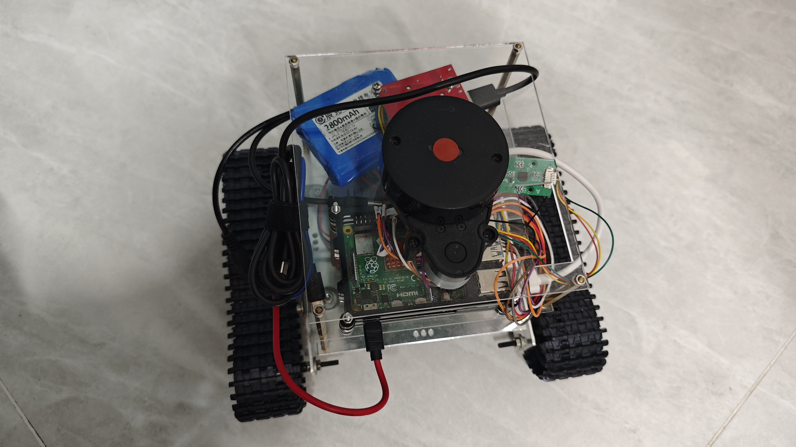

# Cartographer-Nav2小车
    
## 1 环境
### 1.1 硬件
小车：树莓派4B、履带小车（使用17HS4401步进电机*2）、LD14单线激光雷达  
  
上位机：笔记本  
### 1.2 软件
ubuntu 22.04  
ros2-humble（鱼香ros）  

# 2 结构
## 2.1 小车
### 2.1.1 car_controller
订阅/cmd_vel话题，基于两轮模型将角速度与线速度转为左右履带的速度，通过树莓派引脚控制步进电机转速，控制小车的移动和转向。  
### 2.1.2 ldlidar_sl_ros2
ld14激光雷达官方例程，发布/scan话题。参考官方文档  
### 2.1.3 launch_car
用于启动上述两个节点  

## 2.2 上位机
### 2.2.1 car_description
描述小车的结构，建立激光雷达到小车的坐标变换（base_link -> base_laser）  
### 2.2.1  ros2_laser_scan_matcher
使用激光雷达建立odom坐标系（odom -> base_link），参考：  
https://github.com/AlexKaravaev/ros2_laser_scan_matcher  

### 2.2.2 car_cartographer
启动cartographer绘制地图，参考：  
https://fishros.com/d2lros2/#/humble/chapt10/get_started/3.%E9%85%8D%E7%BD%AEFishBot%E8%BF%9B%E8%A1%8C%E5%BB%BA%E5%9B%BE  

### 2.2.3 fishbot_navigation2
启动nav2，参考：  
https://fishros.com/d2lros2/#/humble/chapt11/get_started/2.%E4%B8%BAFishBot%E9%85%8D%E7%BD%AENav2  

# 参考  
https://fishros.com/d2lros2  
https://blog.csdn.net/scarecrow_sun/article/details/128992820  
https://blog.csdn.net/scarecrow_sun/article/details/129474844  
